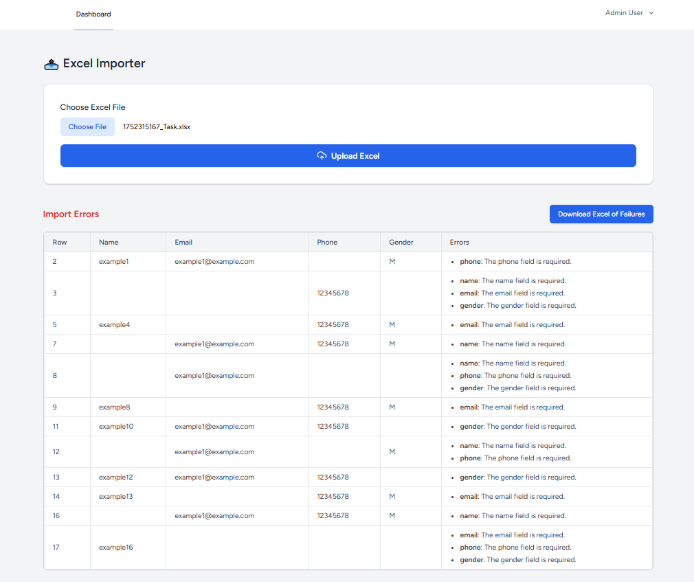

# 📥 Laravel Excel Importer with Validation (Laravel 12 + React + Inertia.js)

This project provides a complete solution for importing Excel files with row-level validation, built using **Laravel 12**, **React**, and **Inertia.js**. It includes:

-  Excel file upload via frontend
-  Per-row validation on the backend
-  Displays failed rows with detailed error messages
-  Saves only valid rows into the database
-  Returns a downloadable Excel file containing failed rows and errors
-  Breeze-based authentication
-  Laravel Telescope for debugging
-  Default seeded admin user

---

## Tech Stack

| Layer      | Technology                     |
|------------|--------------------------------|
| Backend    | Laravel 12 (PHP 8.2)           |
| Frontend   | React (via Inertia.js)         |
| Auth       | Laravel Breeze (Inertia stack) |
| Excel      | [Maatwebsite/Laravel-Excel](https://laravel-excel.com/) |
| File Upload| Axios + FormData               |
| Debugging  | Laravel Telescope              |

---

##  Features

- Upload `.xlsx` or `.xls` files from the UI
- Validates each row with Laravel’s validator:
    - Required fields
    - Format checks
    - Custom validation rules
- Saves only valid rows to the database
- Returns:
    - A summary (e.g., `12 rows imported, 3 rows failed`)
    - A downloadable Excel of failed rows + errors
- Shows failure list in a styled React table
- Includes admin seeder for quick login
- Laravel Telescope preinstalled for debugging API requests, logs, DB, etc.

---

## 📦 Installation

### 1. Clone the repository

```bash
https://github.com/saanchita-paul/excel-importer.git
cd excel-importer
```

### 2. Install PHP dependencies
```bash
composer install
```

### 3. Install JS dependencies
```bash
npm install
```

### 4. Copy .env
```bash
cp .env.example .env
php artisan key:generate

```

###  Configure .env (DB)
Set your DB credentials settings in .env:
```bash
DB_DATABASE=your_database
DB_USERNAME=root
DB_PASSWORD=

```


### 6. Run migrations and seeders
```angular2html
php artisan migrate --seed

```
This will seed an admin user:
```bash
Email: admin@example.com
Password: password
```

### 7. Install Laravel Telescope
```bash
php artisan telescope:install
php artisan migrate

```
**You can access Telescope at: http://127.0.0.1:8000/telescope (Only in local environment)**

### 8. Link Storage (for Excel Downloads)
After running migrations, don't forget to create a symbolic link to your storage directory so that failed Excel files can be downloaded:

```bash
php artisan storage:link

```
This will make your stored Excel files accessible via public/storage.

###  Running the App
1. Start the Laravel server
   ```bash
   php artisan serve
   ```
2. Start the frontend
   ```bash
    npm run dev
   ```

### Output

